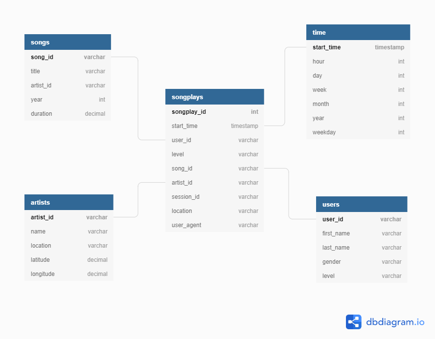

# Sparkify Database
UDACITY Project - Data Modeling with Postgres

## Introduction
A startup called Sparkify wants to analyze the data they've been collecting on songs and user activity on their new music streaming app. The analytics team is particularly interested in understanding what songs users are listening to. Currently, they don't have an easy way to query their data, which resides in a directory of JSON logs on user activity on the app, as well as a directory with JSON metadata on the songs in their app.

## Project Description
In this project, I'll apply what I've learned on data modeling with Postgres and build an ETL pipeline using Python. To complete the project, I will need to define fact and dimension tables for a star schema for a particular analytic focus, and write an ETL pipeline that transfers data from files in two local directories into these tables in Postgres using Python and SQL.

# Database Schemas
## Fact Table
+ songplay
## Dimension Tables
+ users
+ songs
+ artists
+ time

# Files
+ create_tables.py -- drops and creates the tables. 
+ etl.py -- reads and processes files from song_data and log_data and loads them into the tables.
+ sql_queries.py -- contains all the sql queries, and is imported into create_tables.py and etl.py.
+ /data/

# How to Run

1. Run create_tables.py 
2. Run etl.py  

# Enviroment 

1. Python 3 (with Pandas and psycopg2)
2. Postgres  

